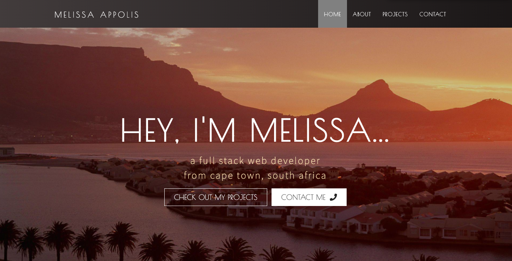
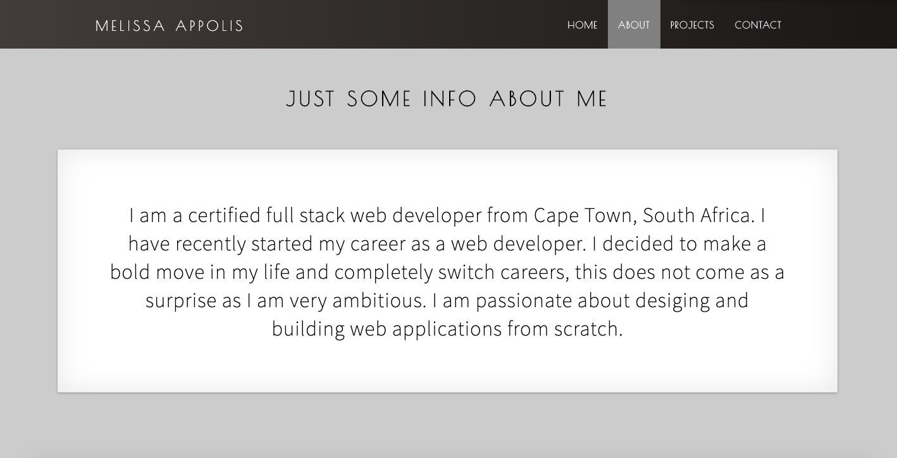
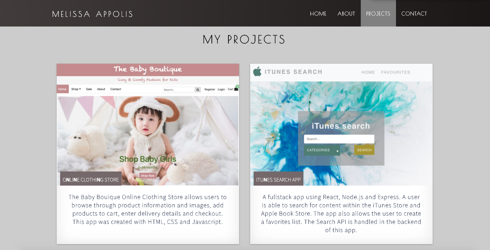
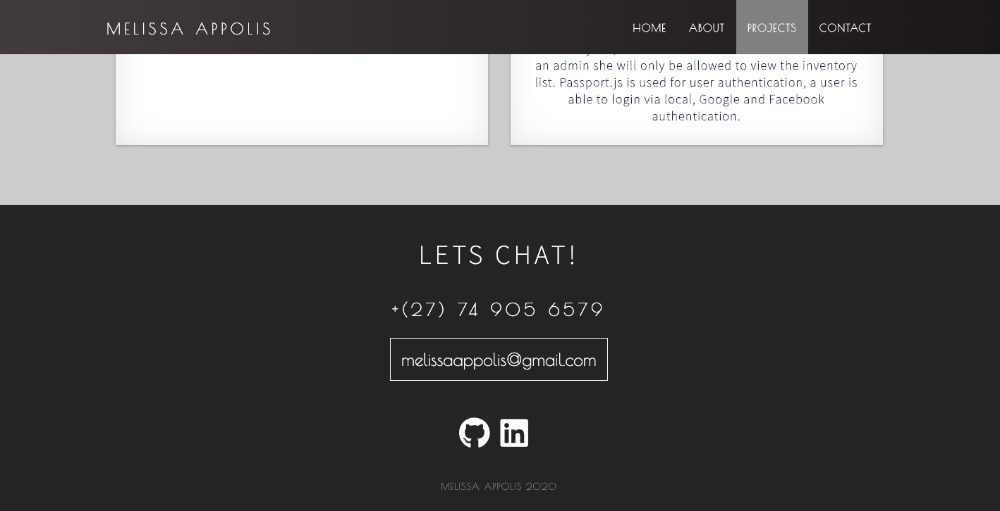

# Developer Portfolio - React.js

## Description

This is my single page responsive developer portfolio that showcases my projects I created thus far using React.js.

Check out my [developer portfolio]()

## Installation

Navigate to the project root folder, in your terminal type in `npm install`, once the node_modules are installed type in `npm start`.
Go to `http://localhost:3000`.

## Usage
### Landing Section
The landing section greets the user to my page with my name and occupation. The user is able to click to view my projects or contact me.
The user is able to navigate to all the sections using the navigation bar.

### About Section
The user can navigate to the about section.

### Projects Section
The projects section displays all the projects I have created.

### Contact Section
The contact section displays my contact details.

## Credits
Created by [@MelissaAppolis](https://github.com/MelissaAppolis)
